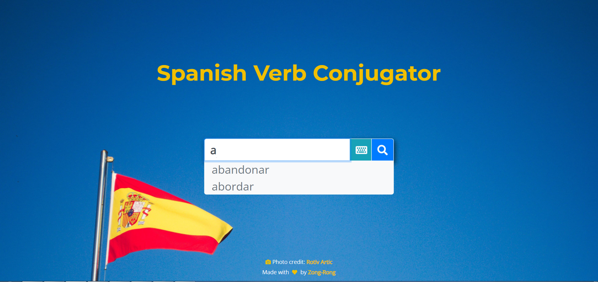
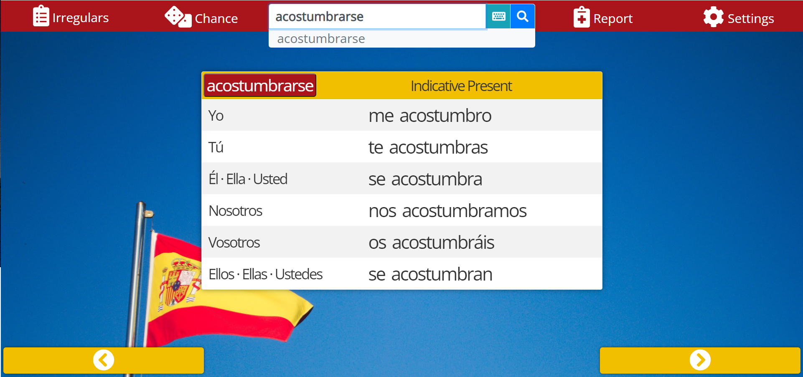

# Spanish Verb Conjugator

> App version: 0.1

## Introduction

**Spanish Verb Conjugator** is a web app developed to help Spanish learners better explore and memorize conjugations of Spanish verbs. This app comes with conjugation data of over 600 verbs and provides multiple tools for browsing and practicing with the conjugations.

Demo: [https://zongronghuang.github.io/spanish_verb_conjugator/](https://zongronghuang.github.io/spanish_verb_conjugator/)

> Note:
>
> - For users with limited data usage or slow network connection, this app (with the Spanish verb conjugation database included) may consume excessive resources.
> - When using mobile devices with a small screen, you can change the device orientation to unlock certain features.
> - The _vos_ forms in Argentine Spanish are not available in this web app.

## Usage instructions

### :mag_right: Search a verb

The search bar helps you access conjugations of a desired Spanish verb with ease:

1. Enter a Spanish verb in the search bar. The app accepts only the infinitive form of the verb:

   - To enter special characters in Spanish (e.g. **á**), click on the keyboard icon to open a virtual keyboard and click on an intended character.

1. The app offers possible verb matches to choose from as you are typing. You can select the match by using the up and down arrow keys on your keyboard.

1. Click on the magnifying-glass icon, click on a displayed verb match, or hit Enter to search the verb's conjugations.

### :eyeglasses: Switch between conjugations

You can browse a specific conjugation of the verb in either way:

- Click on the left and right arrows on the page bottom.
- Click **Settings** (the cogwheel icon) in the top right corner. Then, select the desired mood and tense in the **Mood & tense** section to show the corresponding conjugation.

### :cookie: Play with use modes

You can practice with Spanish conjugations in three modes:

1. Click on **Settings** (the cogwheel icon) in the top right corner.
1. Choose a use mode in the **Use mode** section:
   - **View**: You can browse all the conjugations of the verb.
   - **Flash card**: You can flip open and close the conjugation table as a card by clicking on the eye icons.
   - **Fill-in**: You can fill in conjugation forms by person in the corresponding fields and verify your answers.

### :circus_tent: Try learning tools

You can experiment with other tools for learning Spanish verb conjugations:

- **Verb information**: View the verbs definition, gerund and past participle by clicking the infinitive form in the top left corner of the conjugation table.
- **Irregular verb list**: Find high-frequency irregular verbs in Spanish by clicking **Irregulars** in the top bar.
- **Random verb**: Show a random verb and its conjugations by clicking **Chance** in the top bar.
- **Personal search history**: Show the top 10 verbs that you have searched most often during the past seven days of use by clicking **Report** in the top bar.

### :sunglasses: Learn even while offline

After the app is downloaded to the browser, you can use it offline until you close the tab.

---

## :memo: Development notes

I built this app on Vue 2 and Bootstrap 4 as a personal project to hone and improve on my software development skills.

This app cannot be complete without third-party resources. I would like to give credits and many thanks to the following open-source contributors, whom I have never met in person or on the network:

- **Photography**: [Image](https://unsplash.com/photos/g_wXjMR2n8M) by [Rotiv Artic](https://unsplash.com/@rotivartic) on Unsplash

- **Spanish verb conjugation database**:
  - [Fred F. Jehle](https://users.pfw.edu/jehle/VERBLIST.HTM) created the original database
  - [ghidinelli](https://github.com/ghidinelli/fred-jehle-spanish-verbs) compiled the database into a .csv file
  - My contributions:
    - Corrected misplaced 2nd-singular and 2nd-person plural imperative forms and other minor misplacements in the .csv file.
    - Added very few other Spanish verbs
    - Converted the updated collection into a .json file.

I created some custom algorithms that dynamically generate the subjunctive imperfect 2 conjugation and the 1st-person plural imperative form to the data collection. However, these additions are not stored in the .json file and are only accessible via this web app.

> Note:
>
> - This project is under my copyright except for the Spanish verb conjugation database and photography.
> - You are very welcome to point out any errors in the current Spanish verb conjugations to help me improve this data collection.
